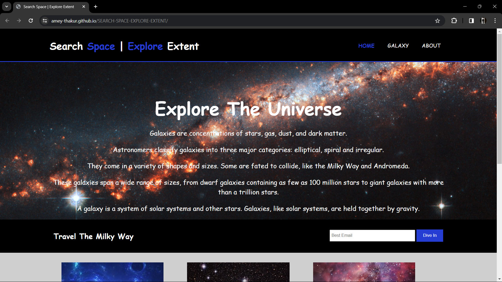
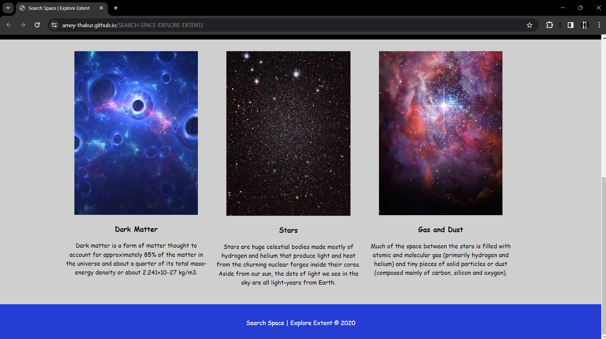
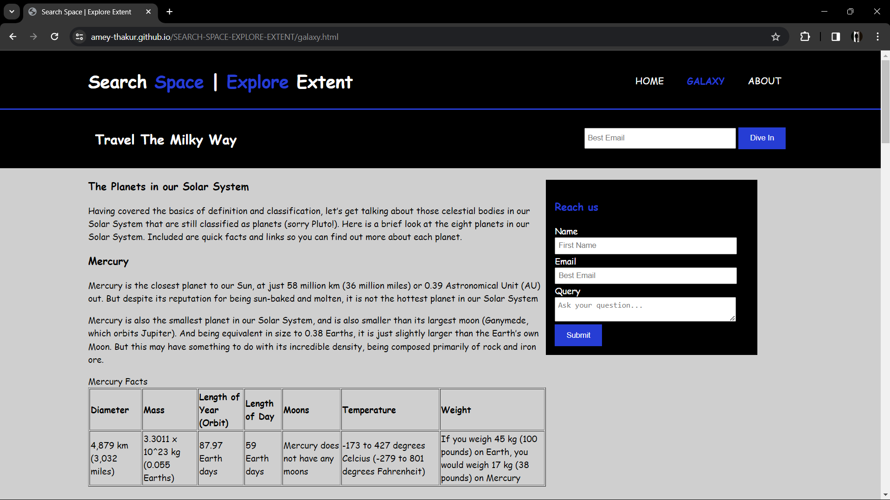
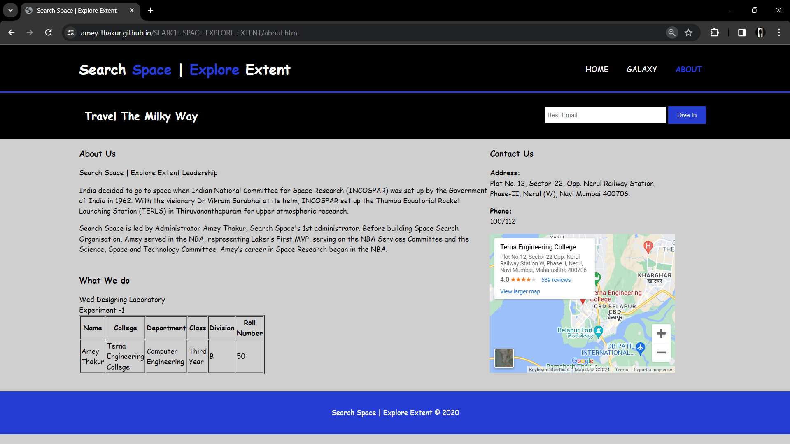

<div align="center">

  <a name="readme-top"></a>
  # Search Space | Explore Extent

  [](LICENSE)
  
  [](https://github.com/Amey-Thakur/SEARCH-SPACE-EXPLORE-EXTENT)
  [](https://github.com/Amey-Thakur)

  A foundational web design project exploring cosmic themes through semantic HTML5 and responsive CSS3 layouts, marking the inception of my journey in web development.

  **[Source Code](Source%20Code/)** &nbsp;·&nbsp; **[Technical Specification](docs/SPECIFICATION.md)** &nbsp;·&nbsp; **[Live Demo](https://amey-thakur.github.io/SEARCH-SPACE-EXPLORE-EXTENT/)**

</div>

---

<div align="center">

  [Authors](#authors) &nbsp;·&nbsp; [Overview](#overview) &nbsp;·&nbsp; [Features](#features) &nbsp;·&nbsp; [Structure](#project-structure) &nbsp;·&nbsp; [Results](#system-architecture--design-gallery) &nbsp;·&nbsp; [Quick Start](#quick-start) &nbsp;·&nbsp; [Usage Guidelines](#usage-guidelines) &nbsp;·&nbsp; [License](#license) &nbsp;·&nbsp; [About](#about-this-repository) &nbsp;·&nbsp; [Acknowledgments](#acknowledgments)

</div>

---

<!-- AUTHORS -->
<div align="center">

  <a name="authors"></a>
  ## Authors

  **Terna Engineering College | Computer Engineering | Batch of 2022**

| <a href="https://github.com/Amey-Thakur"></a><br>[**Amey Thakur**](https://github.com/Amey-Thakur)<br><br>[](https://orcid.org/0000-0001-5644-1575) |
| :---: |

</div>

---

<!-- OVERVIEW -->
<a name="overview"></a>
## Overview

**Search Space | Explore Extent** represents a pivotal milestone as my **First Web Design Project**. Developed during the early phases of my engineering journey, this project focuses on the practical application of core web technologies, HTML5 and CSS3, to create a visually engaging and responsive multi-page website.

The project explores themes of astronomy and galactic exploration, utilizing a dark-themed aesthetic with cosmic imagery, vibrant accents, and smooth interactive elements to enhance the user experience.

> [!TIP]
> **Design Consistency**
>
> The project utilizes a centralized `style.css` to maintain visual harmony across `index.html`, `galaxy.html`, and `about.html`. Modular CSS encourages reusability and ensures that design tokens (colors, typography, spacing) remain consistent across the entire application layer.

---

<!-- FEATURES -->
<a name="features"></a>
## Features

| Feature | Description |
|---------|-------------|
| **Semantic Layout** | Structured using HTML5 semantic tags for accessibility and SEO. |
| **Responsive Grid** | A custom CSS grid and flexbox-based design for cross-device compatibility. |
| **Cosmic Aesthetics** | High-resolution cosmic imagery paired with a curated color palette. |
| **Interactive UX** | Smooth scrolling, hover transitions, and optimized font rendering. |
| **Data Fact-sheets** | Organized presentation of astronomical facts using structured tables. |
| **Integrated Media** | Embedded interactive maps and media assets for regional context. |

### Tech Stack
- **Languages**: HTML5, CSS3
- **Design System**: Vanilla CSS (Custom Responsive Grid & Flexbox)
- **Deployment**: GitHub Actions (Staging Workflow)
- **Hosting**: GitHub Pages

---

<!-- STRUCTURE -->
<a name="project-structure"></a>
## Project Structure

```python
SEARCH-SPACE-EXPLORE-EXTENT/
│
├── .github/                         # GitHub Actions & Automation
│   └── workflows/
│       └── deploy.yml               # Automated Staging & Deployment Flow
│
├── docs/                            # Technical Documentation
│   └── SPECIFICATION.md             # Architecture & Design Specification
│
├── screenshots/                     # Project Visual Archival
│
├── Source Code/                     # Primary Application Layer
│   ├── css/                         # Design System & Stylesheets
│   │   └── style.css                # Global Visual Definition
│   ├── img/                         # Visual Assets & Galactic Imagery
│   ├── about.html                   # Organizational & Attribution View
│   ├── galaxy.html                  # Astronomical Data & Facts View
│   └── index.html                   # Application Gateway (Landing Page)
│
├── .gitattributes                   # Git configuration
├── .gitignore                       # Git exclusion manifest
├── CITATION.cff                     # Scholarly Citation Metadata
├── codemeta.json                    # Machine-Readable Project Metadata
├── LICENSE                          # MIT License Terms
├── README.md                        # Comprehensive Archival Entrance
└── SECURITY.md                      # Security Policy & Protocol
```

---

<!-- RESULTS -->
<a name="system-architecture--design-gallery"></a>
## System Architecture & Design Gallery

<div align="center">

  ### Application Interface (Showcase)
  

  ### Newsletter & Interaction Layer
  

  ### Features & Astronomical Data
  

  ### Application Footer & Attribution
  

</div>

---

<!-- QUICK START -->
<a name="quick-start"></a>
## Quick Start

### 1. Prerequisites
- **Browser**: Any modern standards-compliant web browser (Chrome, Firefox, Edge, Safari).
- **Environment**: No server-side runtime is required; this is a static client-side application.

> [!WARNING]
> **Local Execution**
>
> While the project can be executed by opening `index.html` directly, certain features (like embedded maps or external fonts) may require an active internet connection to resolve correctly.

### 2. Setup & Deployment
1.  **Clone the Repository**:
    ```bash
    git clone https://github.com/Amey-Thakur/SEARCH-SPACE-EXPLORE-EXTENT.git
    cd SEARCH-SPACE-EXPLORE-EXTENT
    ```
2.  **Launch**:
    Open `Source Code/index.html` in your preferred browser.

---

<!-- =========================================================================================
                                     USAGE SECTION
     ========================================================================================= -->
## Usage Guidelines

This repository is openly shared to support learning and knowledge exchange across the academic community.

**For Students**  
Use this project as reference material for understanding foundational web design, CSS layout techniques, and the organization of static web projects. The source code is available for study to facilitate self-paced learning and exploration of responsive design patterns.

**For Educators**  
This project may serve as a practical lab example or supplementary teaching resource for Web Designing Laboratory course (`CSL504`). Attribution is appreciated when utilizing content.

**For Researchers**  
The documentation and design approach may provide insights into academic project structuring and the implementation of foundational web design architectures.

---

<!-- LICENSE -->
<a name="license"></a>
## License

This repository and all its creative and technical assets are made available under the **MIT License**. See the [LICENSE](LICENSE) file for complete terms.

> [!NOTE]
> **Summary**: You are free to share and adapt this content for any purpose, even commercially, as long as you provide appropriate attribution to the original author.

Copyright © 2020 Amey Thakur

---

<!-- ABOUT -->
<a name="about-this-repository"></a>
## About This Repository

**Created & Maintained by**: [Amey Thakur](https://github.com/Amey-Thakur)  
**Academic Journey**: Bachelor of Engineering in Computer Engineering (2018-2022)  
**Institution**: [Terna Engineering College](https://ternaengg.ac.in/), Navi Mumbai  
**University**: [University of Mumbai](https://mu.ac.in/)

This project features the **Search Space**, a web application developed as my **First Web Design** project during the **Web Development Laboratory** curriculum (`2021-07-04`) amidst the global pandemic. It showcases the use of vanilla HTML/CSS to build interactive, themed digital experiences, marking a foundational milestone in my engineering journey.

**Connect:** [GitHub](https://github.com/Amey-Thakur) &nbsp;·&nbsp; [LinkedIn](https://www.linkedin.com/in/amey-thakur) &nbsp;·&nbsp; [ORCID](https://orcid.org/0000-0001-5644-1575)

Grateful acknowledgment to the faculty members of the **Department of Computer Engineering** at Terna Engineering College for their guidance and instruction in foundational web technologies. Their expertise in semantic markup and responsive design principles helped me develop a strong understanding of professional front-end development methodologies.

Special thanks to the **mentors and peers** whose encouragement, discussions, and support contributed meaningfully to this learning experience.

---

<div align="center">

  [↑ Back to Top](#readme-top)

  [Authors](#authors) &nbsp;·&nbsp; [Overview](#overview) &nbsp;·&nbsp; [Features](#features) &nbsp;·&nbsp; [Structure](#project-structure) &nbsp;·&nbsp; [Results](#system-architecture--design-gallery) &nbsp;·&nbsp; [Quick Start](#quick-start) &nbsp;·&nbsp; [Usage Guidelines](#usage-guidelines) &nbsp;·&nbsp; [License](#license) &nbsp;·&nbsp; [About](#about-this-repository) &nbsp;·&nbsp; [Acknowledgments](#acknowledgments)

  <br>

  🔬 **[Web Designing Laboratory](https://github.com/Amey-Thakur/WEB-DESIGNING-LAB)** &nbsp;·&nbsp; 🌌 **[SEARCH-SPACE-EXPLORE-EXTENT](https://amey-thakur.github.io/SEARCH-SPACE-EXPLORE-EXTENT/)**

  ---

  ### 🎓 [Computer Engineering Repository](https://github.com/Amey-Thakur/COMPUTER-ENGINEERING)

  **Computer Engineering (B.E.) - University of Mumbai**

  *Semester-wise curriculum, laboratories, projects, and academic notes.*

</div>


