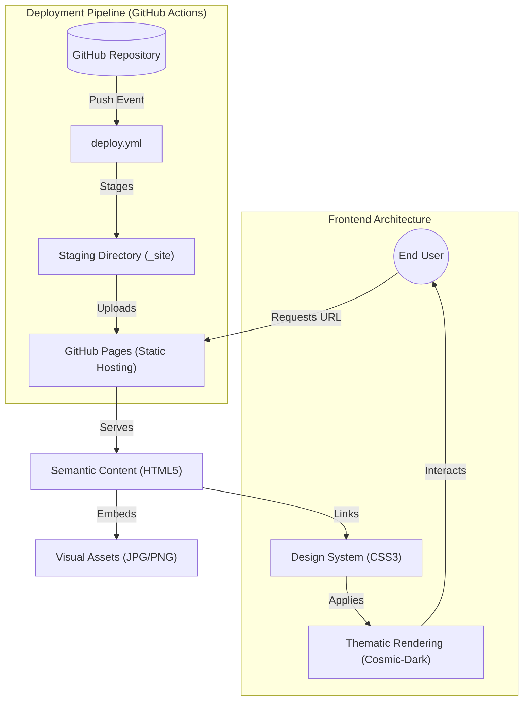

# Technical Specification: SEARCH-SPACE-EXPLORE-EXTENT

## Architectural Overview

**SEARCH-SPACE-EXPLORE-EXTENT** is a semantic HTML5 and CSS3 static web application designed for the archival and visualization of space exploration data. The system prioritizes structural clarity, responsive design, and accessible content delivery without the need for client-side JavaScript, ensuring high performance and long-term compatibility.

### Process & Interaction Flow Diagram

---

## Technical Implementations

### 1. Structure Layer: Semantic HTML5
The application employs a strict semantic structure to optimize for accessibility and search engine visibility.
-   **Semantic Segmentation**: Uses `<header>`, `<nav>`, `<section>`, `<article>`, and `<footer>` elements to define the document outline clearly.
-   **Data Presentation**: Planet-specific datasets in `galaxy.html` are presented using structured `<table>` elements with appropriate `<th>` headers, ensuring data integrity for screen readers.
-   **Form Logic**: The newsletter implementation uses native HTML5 validation (`type="email"`, `required`) to handle user input constraints at the browser level.

### 2. Style Layer: CSS3 Design System
The visual identity is managed through a centralized stylesheet (`style.css`) incorporating modern layout paradigms.
-   **Responsive Grid**: Implements a float-based layout system with media queries to ensure fluidity across desktop and mobile viewports.
-   **Typography Stack**: Utilizes a premium font stack prioritizing `'Inter'`, followed by `'system-ui'`, ensuring high legibility and a modern aesthetic.
-   **UX Enhancements**: Implements `scroll-behavior: smooth;` for seamless fragment navigation and transition effects for navigation elements.

### 3. Deployment Layer: GitHub Actions
Automated deployment ensures that the production site at [GitHub Pages](https://amey-thakur.github.io/SEARCH-SPACE-EXPLORE-EXTENT/) is always synchronized with the `Source Code` directory.
-   **Staging Workflow**: The `deploy.yml` workflow dynamically stages repository contents into a clean `_site` directory before artifact upload, preventing directory nesting issues.
-   **Security**: Uses standard GitHub environment permissions (`pages: write`, `id-token: write`) for secure deployment.

---

## Technical Prerequisites

-   **Runtime**: Any modern standards-compliant web browser (Chrome 80+, Firefox 75+, Safari 13+).
-   **Hosting**: GitHub Pages environment for full CI/CD functionality.
-   **Build Environment**: GitHub Actions (Ubuntu-latest runner).

---

*Technical Specification | Computer Engineering Project | Version 1.0*
